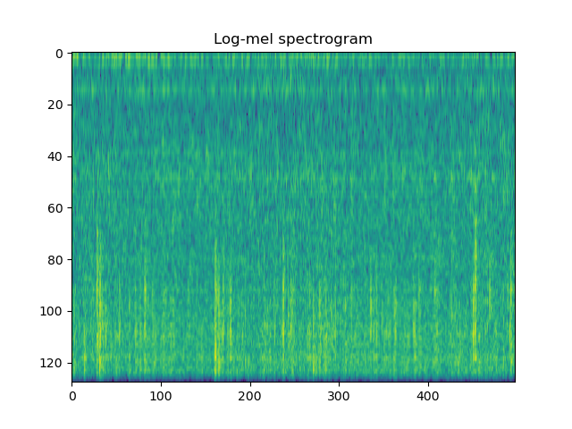

# Audio Spectrogram Transfer

## Training a custom class of AST (Audio Spectrogram Transformer) with log-mel filterbank features on ESC-50 data
Reference paper: [Audio Spectrogram Transformer](https://arxiv.org/pdf/2104.01778.pdf)

### Components:

* Custom implementation of FBANK features, loosely based on python speech features, librosa, and the vggish implementation
* Custom implementation of the core components of the AST, namely:
	* Patch creation
	* Linear projection
	* Positional token creation and embeddings
	* A minimal transformer/attention building block
	* Final linear layer and classification mapping
* A simple CNN baseline to verify correctness of features

- - -

## How to run
* Extract data from the [ESC-50 repository](https://github.com/karolpiczak/ESC-50) and configure the data path of `*.wav` files in `config.data_dir`, and the label path in `config.label_file`.

* To extract features:

  ``` python get_features.py ```

* To train a model, select the choice of model (`model_name`) and its parameters in `config.py`. Then:

  ``` python train_model.py ```

* To evaluate:

  ``` python evaluate_model.py ```


### Requirements
This code requires PyTorch, and can be run on either a CPU or GPU. You can re-create the environment from the conda yaml file as follows:
`` conda env create -f ast-environment.yml ``
- - -

## Structure
The code is configured in `lib/config.py`, which includes parameters that define the directories for saving outputs, and parameters that control feature transformation, the transformer architecture, and the training loop (e.g. batch size, learning rate, epochs). There is also an option to debug which plots intermediate data shapes (for debugging transformer blocks, embeddings etc.) and plots (e.g. during feature creation).

### Log-mel features
The features are parameterised in lengths in units of samples, in `config.py`. By default, we use a Hanning window of 25 ms every 10 ms, and an FFT size of 512, with 128 log-mel coefficients. This creates an example feature representation as follows:



We also include per-sample normalisation (`norm_per_sample`), which removes the mean and divides each spectrogram input by its standard deviation.

### Transformer

Unlike in the original code accompanying the paper, the transformers implemented here include only the minimal core components, with no pre-training. The AST does not use the ViT building blocks, and hence is a simple minimal implementation. You can build on this implementation by adding any building blocks as desired to increase complexity.
The encoder properties are set with `embed_dim`, `num_heads`, and `depth` in `lib/config.py`.

Below is an example model structure with `embed_dim = 768`, `num_heads = 6`, `depth = 3`:

<details>
  <summary>
    AST Model print output
  </summary>
<code>
<pre>
AST(
  (proj): Conv2d(1, 768, kernel_size=(16, 16), stride=(16, 16))
  (pos_drop): Dropout(p=0.1, inplace=False)
  (transformer): TransformerBlocks(
    (blocks): Sequential(
      (0): Block(
        (norm1): LayerNorm((768,), eps=1e-05, elementwise_affine=True)
        (attn): Attention(
          (qkv): Linear(in_features=768, out_features=2304, bias=False)
          (attn_drop): Dropout(p=0.0, inplace=False)
          (proj): Linear(in_features=768, out_features=768, bias=True)
          (proj_drop): Dropout(p=0.0, inplace=False)
        )
        (ls1): Identity()
        (drop_path1): Identity()
        (norm2): LayerNorm((768,), eps=1e-05, elementwise_affine=True)
        (mlp): Mlp(
          (fc1): Linear(in_features=768, out_features=3072, bias=True)
          (act): GELU()
          (drop1): Dropout(p=0.0, inplace=False)
          (fc2): Linear(in_features=3072, out_features=768, bias=True)
          (drop2): Dropout(p=0.0, inplace=False)
        )
        (ls2): Identity()
        (drop_path2): Identity()
      )
      (1): Block(
        (norm1): LayerNorm((768,), eps=1e-05, elementwise_affine=True)
        (attn): Attention(
          (qkv): Linear(in_features=768, out_features=2304, bias=False)
          (attn_drop): Dropout(p=0.0, inplace=False)
          (proj): Linear(in_features=768, out_features=768, bias=True)
          (proj_drop): Dropout(p=0.0, inplace=False)
        )
        (ls1): Identity()
        (drop_path1): Identity()
        (norm2): LayerNorm((768,), eps=1e-05, elementwise_affine=True)
        (mlp): Mlp(
          (fc1): Linear(in_features=768, out_features=3072, bias=True)
          (act): GELU()
          (drop1): Dropout(p=0.0, inplace=False)
          (fc2): Linear(in_features=3072, out_features=768, bias=True)
          (drop2): Dropout(p=0.0, inplace=False)
        )
        (ls2): Identity()
        (drop_path2): Identity()
      )
      (2): Block(
        (norm1): LayerNorm((768,), eps=1e-05, elementwise_affine=True)
        (attn): Attention(
          (qkv): Linear(in_features=768, out_features=2304, bias=False)
          (attn_drop): Dropout(p=0.0, inplace=False)
          (proj): Linear(in_features=768, out_features=768, bias=True)
          (proj_drop): Dropout(p=0.0, inplace=False)
        )
        (ls1): Identity()
        (drop_path1): Identity()
        (norm2): LayerNorm((768,), eps=1e-05, elementwise_affine=True)
        (mlp): Mlp(
          (fc1): Linear(in_features=768, out_features=3072, bias=True)
          (act): GELU()
          (drop1): Dropout(p=0.0, inplace=False)
          (fc2): Linear(in_features=3072, out_features=768, bias=True)
          (drop2): Dropout(p=0.0, inplace=False)
        )
        (ls2): Identity()
        (drop_path2): Identity()
      )
    )
  )
  (FinalLinear): Sequential(
    (0): LayerNorm((768,), eps=1e-05, elementwise_affine=True)
    (1): Linear(in_features=768, out_features=50, bias=True)
  )
)
	</pre>
	</code>
</details>

## Model training and evaluation
The model is trained with a 5-fold validation strategy, where the model is trained on 80% of the training data, e.g. splits 1, 2, 3, 4, and tested on the remaining 20% (split 5). This procedure is iterated such that the model performance over `cv_fold` `i` is evaluated by training on all the remaining `cv_fold`s except `i`. No data augmentation was performed due to time constraints.


## Results
For the models, the results can be accessed in `plots/`. Results are reported as means ± standard deviations over 5 folds. We note that the weighted and macro average are identical for this dataset as each fold is balanced with 8 instances.

| Model                    | Average Precision | Average Recall | Average F1 |
|--------------------------|-------------------|----------------|------------|
| 2-layer-5x5-kernel-CNN   | 0.208 ± 0.045     | 0.202 ± 0.036  |0.200 ± 0.040|
| AST-6-head-3-depth       | 0.040  ± 0.011    | 0.060 ± 0.012  |0.041 ± 0.013|
| Random guess (reference) | 0.02              | 0.02           | 0.02       |

- - -
# Known issues/working notes:
* The model achieves good performance on training data, but more time is needed to generalise well across splits. There is likely a bug within `models.py` or `transformer_encoder.py` with how the model is defined.
* As a result of the way frames are calculated, we need to verify that the time dimensions of FBANK features match the ones in the original paper. This may affect good parameter choices for the embedding and token lengths.
* Paper uses Hamming window, Hanning implemented here.
* Results are output per single classification fold and saved to a text file. These can be stored in the dictionary during the evaluation loop and automatically computed
* Models were terminated according to early stopping with `config.max_overrun` according to the training accuracy. Time permitting we would change this to a stratified validation set within each fold.
* The `yaml` file supplied is exhaustive, and needs ablation to a minimum set of packages.
* The code is in need of a refactor, and better documentation for the PyTorch + transformer parts. Time limited.
